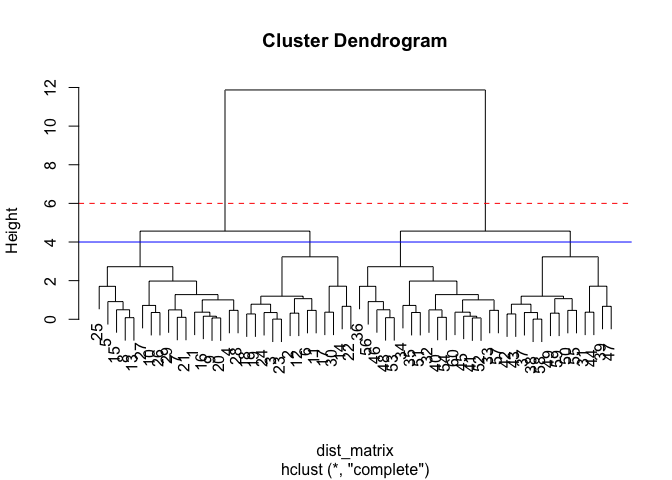
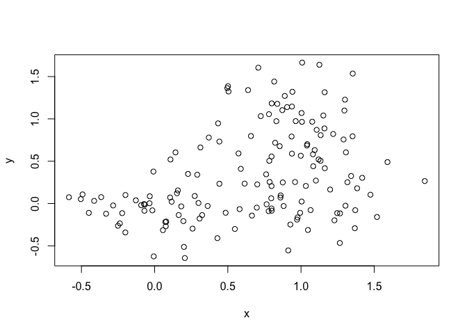
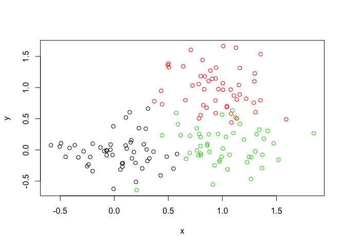

Class09
================
Megan Truong
2/4/2020

## K- means clustering

the main l-means function inR is called kmeans() rev: reverses order of
function

``` r
# Generate some example data for clustering
tmp <- c(rnorm(30,-3), rnorm(30,3))
x <- cbind(x=tmp, y=rev(tmp))
plot(x)
```

<!-- -->

Use the kmeans() function setting k to 2 and nstart=20 Inspect/print the
results Q. How many points are in each cluster? Q. What ‘component’ of
your result object details - cluster size? - cluster
assignment/membership? - cluster center? Plot x colored by the kmeans
cluster assignment and add cluster centers as blue points

``` r
km <- kmeans(x, centers = 2, nstart = 20)
km
```

    ## K-means clustering with 2 clusters of sizes 30, 30
    ## 
    ## Cluster means:
    ##           x         y
    ## 1 -2.742656  2.851844
    ## 2  2.851844 -2.742656
    ## 
    ## Clustering vector:
    ##  [1] 1 1 1 1 1 1 1 1 1 1 1 1 1 1 1 1 1 1 1 1 1 1 1 1 1 1 1 1 1 1 2 2 2 2 2 2 2 2
    ## [39] 2 2 2 2 2 2 2 2 2 2 2 2 2 2 2 2 2 2 2 2 2 2
    ## 
    ## Within cluster sum of squares by cluster:
    ## [1] 39.89134 39.89134
    ##  (between_SS / total_SS =  92.2 %)
    ## 
    ## Available components:
    ## 
    ## [1] "cluster"      "centers"      "totss"        "withinss"     "tot.withinss"
    ## [6] "betweenss"    "size"         "iter"         "ifault"

``` r
# Cluster size
km$size
```

    ## [1] 30 30

``` r
# Cluster
km$cluster
```

    ##  [1] 1 1 1 1 1 1 1 1 1 1 1 1 1 1 1 1 1 1 1 1 1 1 1 1 1 1 1 1 1 1 2 2 2 2 2 2 2 2
    ## [39] 2 2 2 2 2 2 2 2 2 2 2 2 2 2 2 2 2 2 2 2 2 2

``` r
#cluster center
length(km$cluster)
```

    ## [1] 60

``` r
table(km$cluster)
```

    ## 
    ##  1  2 
    ## 30 30

``` r
plot(x, col=km$cluster)
points(km$centers, col = "blue", pch = 15, cex =3)
```

<!-- -->

\#\# Hierarchial clustering in R

The main Hierarchical clustering function in R is called hclust()
Important: have to calculate the distance matrix deom of input data
before calling hclus()

``` r
# First we need to calculate point (dis)similarity
# as the Euclidean distance between observations
dist_matrix <- dist(x)
# The hclust() function returns a hierarchical
# clustering model
hc <- hclust(d = dist_matrix)
# the print method is not so useful here
hc 
```

    ## 
    ## Call:
    ## hclust(d = dist_matrix)
    ## 
    ## Cluster method   : complete 
    ## Distance         : euclidean 
    ## Number of objects: 60

``` r
plot(hc)
abline(h=6, col ="red", lty =2)
abline(h=4, col="blue")
```

<!-- -->

To get cluster membership- vector need to cut the tree at a certian
height to yield separate cluster
    branches

``` r
cutree(hc, h=6)
```

    ##  [1] 1 1 1 1 1 1 1 1 1 1 1 1 1 1 1 1 1 1 1 1 1 1 1 1 1 1 1 1 1 1 2 2 2 2 2 2 2 2
    ## [39] 2 2 2 2 2 2 2 2 2 2 2 2 2 2 2 2 2 2 2 2 2 2

``` r
gp4 <- cutree(hc, h=4)
table(gp4)
```

    ## gp4
    ##  1  2 
    ## 30 30

## More

``` r
# Step 1. Generate some example data for clustering
x <- rbind(
 matrix(rnorm(100, mean=0, sd = 0.3), ncol = 2), # c1
 matrix(rnorm(100, mean = 1, sd = 0.3), ncol = 2), # c2
 matrix(c(rnorm(50, mean = 1, sd = 0.3), # c3
 rnorm(50, mean = 0, sd = 0.3)), ncol = 2))
colnames(x) <- c("x", "y")
# Step 2. Plot the data without clustering
plot(x)
```

<!-- -->

``` r
# Step 3. Generate colors for known clusters
# (just so we can compare to hclust results)
col <- as.factor( rep(c("c1","c2","c3"), each=50) )
plot(x, col=col)
```

<!-- --> Boundaries
of clusters are not always clear…need to cut

``` r
hc <- hclust(dist(x))
hc
```

    ## 
    ## Call:
    ## hclust(d = dist(x))
    ## 
    ## Cluster method   : complete 
    ## Distance         : euclidean 
    ## Number of objects: 150

``` r
plot(hc)
abline(h=1.7, col = "red")
```

<!-- --> Cut Tree

``` r
grps <- cutree(hc, k =3)
grps
```

    ##   [1] 1 1 1 1 2 1 3 2 2 3 3 3 3 2 3 3 1 1 2 2 1 1 3 2 2 3 2 1 3 3 1 2 3 2 1 1 3
    ##  [38] 2 1 1 1 3 3 1 1 1 3 1 1 1 3 3 3 3 3 3 3 3 3 3 3 3 3 3 3 3 3 3 3 3 3 3 3 3
    ##  [75] 3 3 3 3 3 3 3 3 3 3 3 3 3 3 3 3 3 3 3 3 3 3 3 3 3 3 1 3 3 3 3 3 1 1 3 3 3
    ## [112] 3 1 3 3 3 1 3 3 3 3 3 3 3 1 1 3 3 3 3 1 3 3 3 3 1 3 3 3 1 3 1 1 3 3 1 3 3
    ## [149] 1 3

``` r
table(grps)
```

    ## grps
    ##   1   2   3 
    ##  36  12 102

``` r
plot(x, col = grps)
```

<!-- -->

## PCS of Uk food data

``` r
x <- read.csv("UK_foods.csv", row.names = 1)
x
```

    ##                     England Wales Scotland N.Ireland
    ## Cheese                  105   103      103        66
    ## Carcass_meat            245   227      242       267
    ## Other_meat              685   803      750       586
    ## Fish                    147   160      122        93
    ## Fats_and_oils           193   235      184       209
    ## Sugars                  156   175      147       139
    ## Fresh_potatoes          720   874      566      1033
    ## Fresh_Veg               253   265      171       143
    ## Other_Veg               488   570      418       355
    ## Processed_potatoes      198   203      220       187
    ## Processed_Veg           360   365      337       334
    ## Fresh_fruit            1102  1137      957       674
    ## Cereals                1472  1582     1462      1494
    ## Beverages                57    73       53        47
    ## Soft_drinks            1374  1256     1572      1506
    ## Alcoholic_drinks        375   475      458       135
    ## Confectionery            54    64       62        41

``` r
# number of rows and columns
nrow(x)
```

    ## [1] 17

``` r
ncol(x)
```

    ## [1] 4

Making plots to explore the data

``` r
barplot(as.matrix(x), beside=T, col=rainbow(nrow(x)))
```

<!-- -->

``` r
barplot(as.matrix(x), beside=F, col=rainbow(nrow(x)))
```

<!-- -->

A “pairs” plot can be helpful when we have small datasets like this one
but often we are dealing with data that is too large for this approach

``` r
pairs(x, col=rainbow(10), pch=16)
```

<!-- -->

``` r
pca <- prcomp( t(x) )
summary(pca)
```

    ## Importance of components:
    ##                             PC1      PC2      PC3       PC4
    ## Standard deviation     324.1502 212.7478 73.87622 4.189e-14
    ## Proportion of Variance   0.6744   0.2905  0.03503 0.000e+00
    ## Cumulative Proportion    0.6744   0.9650  1.00000 1.000e+00

``` r
attributes(pca)
```

    ## $names
    ## [1] "sdev"     "rotation" "center"   "scale"    "x"       
    ## 
    ## $class
    ## [1] "prcomp"

``` r
plot(pca$x[,1], pca$x[,2])
```

<!-- -->

``` r
summary(pca)
```

    ## Importance of components:
    ##                             PC1      PC2      PC3       PC4
    ## Standard deviation     324.1502 212.7478 73.87622 4.189e-14
    ## Proportion of Variance   0.6744   0.2905  0.03503 0.000e+00
    ## Cumulative Proportion    0.6744   0.9650  1.00000 1.000e+00

``` r
plot(pca$x[,1], pca$x[,2], xlab="PC1", ylab="PC2", xlim=c(-270,500))
text(pca$x[,1], pca$x[,2], colnames(x),
     col=c("black", "red", "blue", "green"))
```

<!-- -->

``` r
## Lets focus on PC1 as it accounts for > 90% of variance 
par(mar=c(10, 3, 0.35, 0))
barplot( pca$rotation[,1], las=2 )
```

<!-- -->
