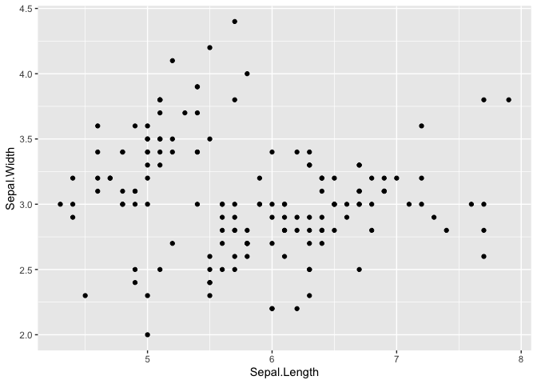
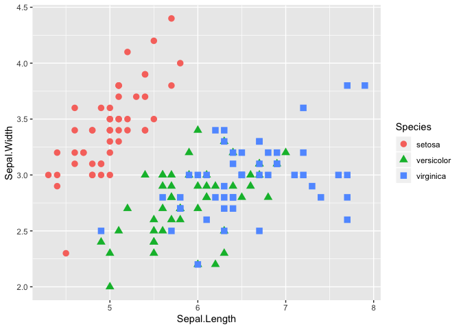
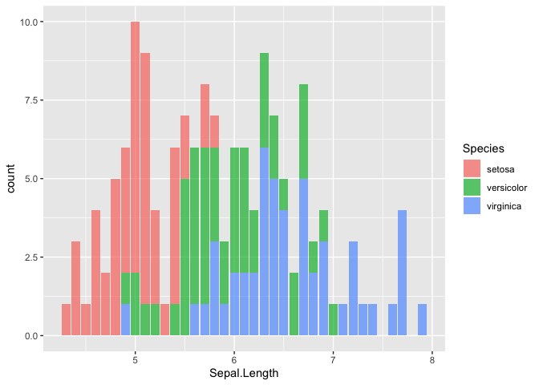

Class\_07
================
Megan Truong
1/28/2020

fname \<- function(arg1, arg2) { }

Theese are functions here

``` r
function(x, na.rm=TRUE, plot=FALSE, ...) {
  # Our rescale function from the end of lecture 9

 if( !is.numeric(x) ) {
 stop("Input x should be numeric", call.=FALSE)
 }
   
  if(na.rm) {
    rng <-range(x, na.rm=TRUE)
  } else {
    rng <-range(x)
  }

  answer <- (x - rng[1]) / (rng[2] - rng[1])
  if(plot) { 
    plot(answer, ...) 
  }

  return(answer)
}
```

    ## function(x, na.rm=TRUE, plot=FALSE, ...) {
    ##   # Our rescale function from the end of lecture 9
    ## 
    ##  if( !is.numeric(x) ) {
    ##  stop("Input x should be numeric", call.=FALSE)
    ##  }
    ##    
    ##   if(na.rm) {
    ##     rng <-range(x, na.rm=TRUE)
    ##   } else {
    ##     rng <-range(x)
    ##   }
    ## 
    ##   answer <- (x - rng[1]) / (rng[2] - rng[1])
    ##   if(plot) { 
    ##     plot(answer, ...) 
    ##   }
    ## 
    ##   return(answer)
    ## }

“warning()” break functions that will give warning and text; tolerable
error

“stop()” stops running after warning for intolerable error

``` r
# Lets define an example x and y
x <- c( 1, 2, NA, 3, NA)
y <- c(NA, 3, NA, 3, 4)
```

``` r
is.numeric(x)
```

    ## [1] TRUE

``` r
is.na(x)
```

    ## [1] FALSE FALSE  TRUE FALSE  TRUE

Compare x and y

``` r
is.na(x) & is.na(y)
```

    ## [1] FALSE FALSE  TRUE FALSE FALSE

``` r
is_both_na <- function(x,y) {
  if(length(x) != length(y))
    stop("your inputs aren't the same length")

  return(na.number)
}
```

``` r
x <- c( 1, 2, NA, 3, NA)
y <- c(NA, 3, NA, 3, 4)
z <- c(1,1)
```

``` r
rescale_new  <- function(x,y) {
  if(length(x) != length(y))
    stop("your inputs aren't the same length", call = FALSE)

  na.in.both <- ( is.na(x) & is.na(y) )
  na.number <- sum(na.in.both)
  na.which <- which(na.in.both)
  
  message("Found", na.number, "nA's at position(s):",
          paste(na.which, collapse = ","))
  
  return(list(number = na.number, which = na.which))
}


rescale_new(x, y)
```

    ## Found1nA's at position(s):3

    ## $number
    ## [1] 1
    ## 
    ## $which
    ## [1] 3

``` r
# Start with a simple version of the problem
df1 <- data.frame(IDs=c("gene1", "gene2", "gene3"),
  exp=c(2,1,1),
  stringsAsFactors=FALSE)
df2 <- data.frame(IDs=c("gene2", "gene4", "gene3", "gene5"),
  exp=c(-2, NA, 1, 2),
  stringsAsFactors=FALSE)

# Simplify further to single vectors
x <- df1$IDs
y <- df2$IDs

x
```

    ## [1] "gene1" "gene2" "gene3"

``` r
y
```

    ## [1] "gene2" "gene4" "gene3" "gene5"

``` r
intersect(x,y)
```

    ## [1] "gene2" "gene3"

``` r
x %in% y
```

    ## [1] FALSE  TRUE  TRUE

``` r
x[x %in% y]
```

    ## [1] "gene2" "gene3"

``` r
y[y %in% x]
```

    ## [1] "gene2" "gene3"

``` r
cbind(x[x %in% y], y[y %in% x])
```

    ##      [,1]    [,2]   
    ## [1,] "gene2" "gene2"
    ## [2,] "gene3" "gene3"

Make a function: highlight what you want to make a function, click Code
in bar and “Extract Function”

``` r
gene_intersect <- function(x, y) {
  cbind(x[x %in% y], y[y %in% x])
}


x <- df1$IDs
y <- df2$IDs
gene_intersect(x,y)
```

    ##      [,1]    [,2]   
    ## [1,] "gene2" "gene2"
    ## [2,] "gene3" "gene3"

``` r
gene_intersect2 <- function(df1, df2) {
   cbind(df1[df1$IDs %in% df2$IDs, ], 
         df2[df2$IDs %in% df1$IDs, ], "exp")
  
}

gene_intersect2(df1, df2)
```

    ##     IDs exp   IDs exp "exp"
    ## 2 gene2   1 gene2  -2   exp
    ## 3 gene3   1 gene3   1   exp

``` r
gene_intersect3 <- function(df1, df2, gene.colname="IDs") {

 cbind( df1[ df1[,gene.colname] %in%
 df2[,gene.colname], ],
 exp2=df2[ df2[,gene.colname] %in%
 df1[,gene.colname], "exp"] )

}
 
# These are all equivalent functions
df1$IDs
```

    ## [1] "gene1" "gene2" "gene3"

``` r
#df1[,"IDs"]
gene.colname = "IDs"
#df1[ , gene.colname]
 
colnames(df1) = c("IDs", "exp")
df1
```

    ##     IDs exp
    ## 1 gene1   2
    ## 2 gene2   1
    ## 3 gene3   1

``` r
colnames(df2) = c("IDs", "exp")


x <- df1$IDs
y <- df2$IDs
gene_intersect(x,y)
```

    ##      [,1]    [,2]   
    ## [1,] "gene2" "gene2"
    ## [2,] "gene3" "gene3"

``` r
gene_intersect3(df1, df2, gene.colname = "IDs")
```

    ##     IDs exp exp2
    ## 2 gene2   1   -2
    ## 3 gene3   1    1

``` r
# Improve by simplifying for for human consumption
gene_intersect4 <- function(df1, df2, gene.colname="IDs") {

 df1.name <- df1[,gene.colname]
 df2.name <- df2[,gene.colname]

 df1.inds <- df1.name %in% df2.name
 df2.inds <- df2.name %in% df1.name

 cbind( df1[ df1.inds, ],
 exp2=df2[ df2.inds, "exp"] )
}

gene_intersect4(df1, df2)
```

    ##     IDs exp exp2
    ## 2 gene2   1   -2
    ## 3 gene3   1    1

``` r
library("ggplot2")

dim(iris)
```

    ## [1] 150   5

``` r
class(iris)
```

    ## [1] "data.frame"

``` r
head(iris)
```

    ##   Sepal.Length Sepal.Width Petal.Length Petal.Width Species
    ## 1          5.1         3.5          1.4         0.2  setosa
    ## 2          4.9         3.0          1.4         0.2  setosa
    ## 3          4.7         3.2          1.3         0.2  setosa
    ## 4          4.6         3.1          1.5         0.2  setosa
    ## 5          5.0         3.6          1.4         0.2  setosa
    ## 6          5.4         3.9          1.7         0.4  setosa

``` r
myplot <- ggplot(data = iris, aes(x = Sepal.length, y = Sepal.Width))
class(myplot)
```

    ## [1] "gg"     "ggplot"

``` r
ggplot(data = iris, aes(x = Sepal.Length, y = Sepal.Width)) + geom_point()
```

<!-- -->

Change point size, color and
shapes

``` r
ggplot(data = iris, aes(x = Sepal.Length, y = Sepal.Width, color = Species)) + geom_point(aes(shape = Species), size = 3)
```

<!-- -->

With fitted
lines

``` r
ggplot(data = iris, aes(x = Sepal.Length, y = Sepal.Width, color = Species)) + geom_point(aes(shape = Species), size = 3) + geom_smooth(method = "lm")
```

<!-- -->

For a bar graph, alpha changes
transparency

``` r
ggplot(iris, aes(Sepal.Length, fill = Species)) + geom_bar(stat = "count", alpha = 0.7)
```

<!-- -->

you can change way more but we ran out of time
